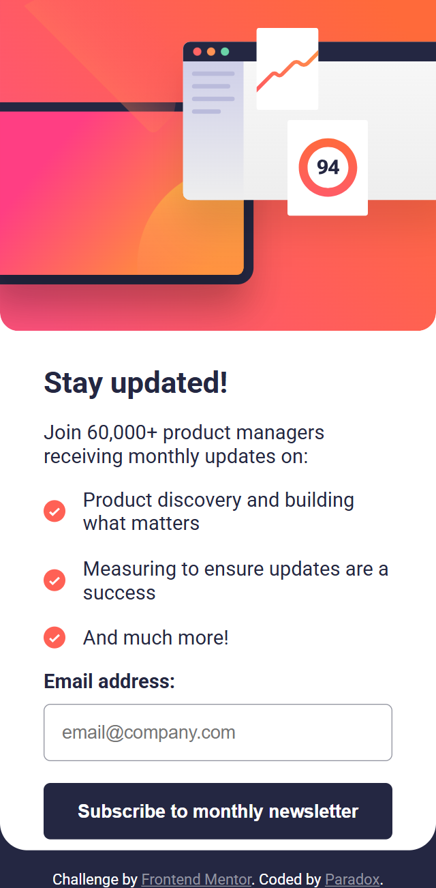
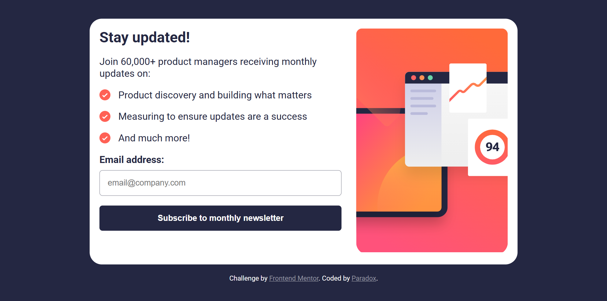

# Frontend Mentor - Newsletter sign-up form with success message solution

This is a solution to the [Newsletter sign-up form with success message challenge on Frontend Mentor](https://www.frontendmentor.io/challenges/newsletter-signup-form-with-success-message-3FC1AZbNrv). Frontend Mentor challenges help you improve your coding skills by building realistic projects. 

## Table of contents

- [Overview](#overview)
  - [The challenge](#the-challenge)
  - [Screenshot](#screenshot)
  - [Links](#links)
- [My process](#my-process)
  - [Built with](#built-with)
  - [What I learned](#what-i-learned)
  - [Continued development](#continued-development)
  - [Useful resources](#useful-resources)
- [Author](#author)
- [Acknowledgments](#acknowledgments)

## Overview

### The challenge

Users should be able to:

- Add their email and submit the form
- See a success message with their email after successfully submitting the form
- See form validation messages if:
  - The field is left empty
  - The email address is not formatted correctly
- View the optimal layout for the interface depending on their device's screen size
- See hover and focus states for all interactive elements on the page

### Screenshot





### Links

- Solution URL: [Solution URL](https://github.com/Taresta/newsletter-sign-up-with-success-message-main.git)
- Live Site URL: [Live Site URL]()

## My process

### Built with

- Semantic HTML5 markup
- CSS custom properties
- Flexbox
- SCSS
- Mobile-first workflow

### What I learned
This project taught me a lot. Here are some key takeaways:

1. Styles not applying: I forgot to link my CSS file, which was why my styles weren’t working.

2. Distorted SVGs: Some icons in my list section appeared bigger or flattened. The issue was caused by flexbox shrinking them, so I applied flex-shrink: 0;, which preserved their aspect ratio.

3. Form styles not updating: The issue was due to my live server not refreshing properly. Restarting the server fixed it.

4. Unexpected width limitation: Even without a max-width, my sections weren’t expanding beyond a certain point. This was due to align-items: center in the parent flex container, which restricted their growth.

5. Image resizing issues: I initially set width: 100%, but since my image was inside a <picture> element, I needed to apply width: 100% to the <picture> as well.

6. Toggling sections with JavaScript: My display: flex; rule was applied using an id, while I was trying to hide it with a class. Since id has higher specificity than class, my styles weren’t applying correctly. Switching to class selectors solved the problem.
7. Mixin usage in SCSS: I learned to use mixins to avoid redundancy. For example:
```
@mixin flex-center {
  display: flex;
  justify-content: center;
  align-items: center;
}
```
Using @include flex-center; in multiple places made my code cleaner.
8. Image scaling problem between 500px-760px: The image was too large in this range. Applying max-height to the <picture> element and setting overflow: hidden helped contain it, and removing max-height for larger screens ensured proper scaling.
9. I had an unnecessary if-else statement in JavaScript where both conditions performed the same action. Removing it simplified my code

### Continued development
 I want to continue improving my:

- Understanding of advanced CSS techniques.

- JavaScript fundamentals to write more efficient, structured code.

- Ability to write clean, semantic, and accessible HTML.

### Useful resources

- [Frontend Mentor Article on Forms](https://www.frontendmentor.io/learning-paths/javascript-fundamentals-oR7g6-mTZ-/steps/66d537703c19191dc3bc0d32/article/read) -  A great overview of managing forms with JavaScript.
- [FreeCodeCamp Article on Forms ](https://www.freecodecamp.org/news/build-and-validate-beautiful-forms-with-vanilla-html-css-js/) - Helped deepen my knowledge of form validation.

## Author

- Website - [Taresta](https://github.com/Taresta)
- Frontend Mentor - [Paradox](https://www.frontendmentor.io/profile/Taresta)
## Acknowledgments
Thanks to all the great articles and good resources out there. Every mistake was a lesson, and every challenge was an opportunity to grow.